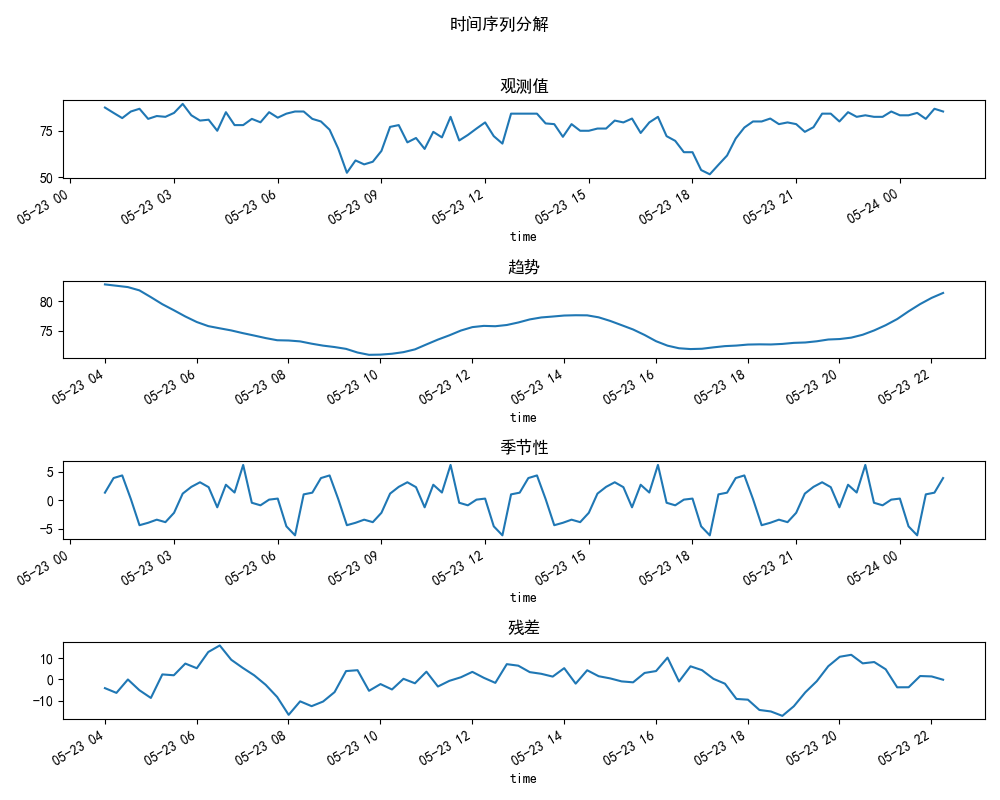
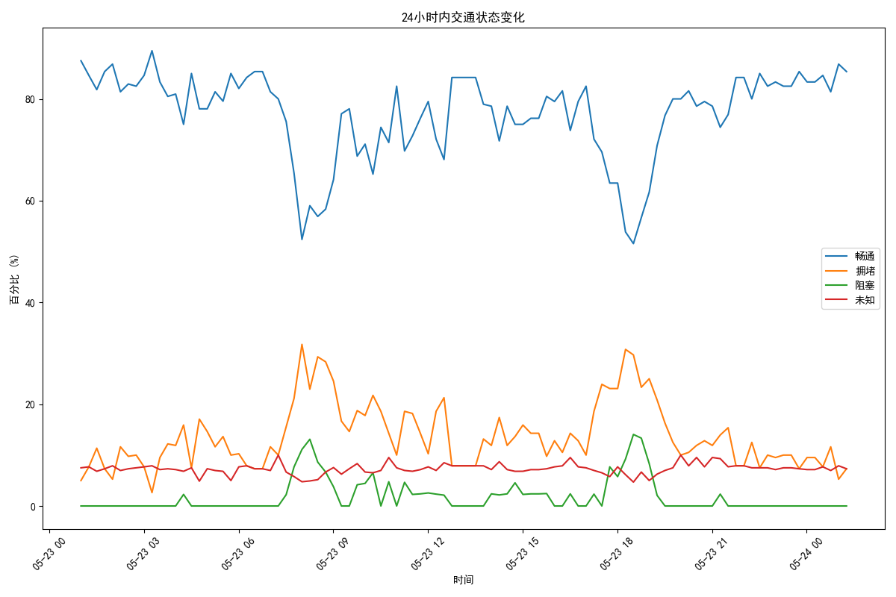
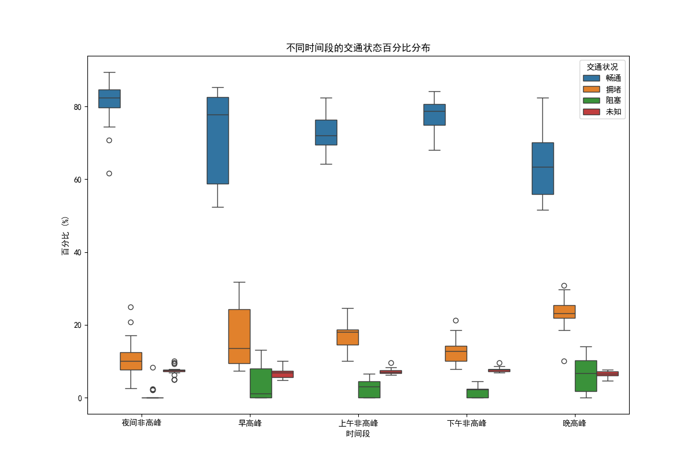
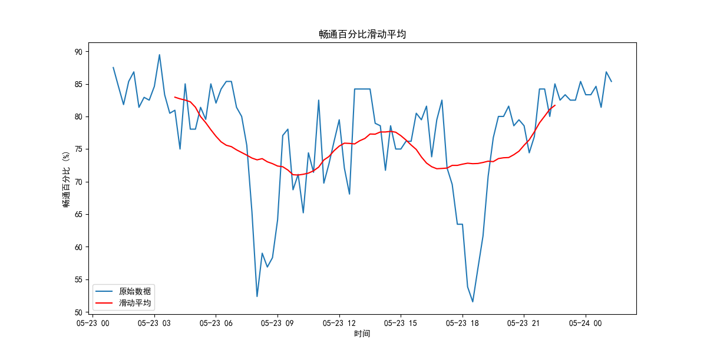

#### 时间序列分解图

时间序列分解图将数据分解为四个部分：观测值、趋势、季节性和残差。以下是对各部分的分析：

1. **观测值（Observed）**：
    - 反映原始数据，24小时内变化范围在50%到80%之间，波动明显。
    - 早高峰（约05:00-09:00）和晚高峰（约17:00-19:00）有显著下降，可能对应交通高峰期。

2. **趋势（Trend）**：
    - 显示长期变化趋势。
    - 早晨时段（约05:00-09:00）呈下降趋势，显示交通状况变差。
    - 中午（约12:00-14:00）相对平稳，下午和晚上（约17:00-22:00）上升，表明交通状况逐渐好转。

3. **季节性（Seasonal）**：
    - 显示周期性波动。
    - 季节性波动在24小时内有多个高峰和低谷，对应不同时间段的交通流量变化。

4. **残差（Residual）**：
    - 去除趋势和季节性后的剩余波动，显示随机噪声。
    - 波动幅度较小，大部分波动由趋势和季节性解释。

### 线图

24小时内交通状态变化的线图，分析如下：

1. **畅通（蓝线）**：
    - 早高峰（约06:00-09:00）和晚高峰（约17:00-19:00）畅通率显著下降，最低接近50%。
    - 午夜和中午时段畅通率较高且稳定，接近80%。

2. **拥堵（橙线）**：
    - 早高峰和晚高峰拥堵率显著上升，早高峰达到20%左右，晚高峰略低。

3. **阻塞（绿线）**：
    - 阻塞率波动较小，早高峰和晚高峰时段有短暂上升，但总体不超过5%。

4. **未知（红线）**：
    - 未知状态的百分比较为平稳，波动较小。

### 结论

- **高峰时段影响显著**：早高峰和晚高峰时段畅通率下降，拥堵率上升，需要采取措施缓解交通压力。
- **非高峰时段的平稳性**：非高峰时段交通状况较好，畅通率高，拥堵率和阻塞率低。

### 箱型图

不同时间段的交通状态百分比分布的箱形图分析如下：

#### 时间段划分

1. **夜间非高峰（0点至6点，19点至24点）**
2. **早高峰（6点至9点）**
3. **上午非高峰（9点至12点）**
4. **下午非高峰（12点至17点）**
5. **晚高峰（17点至19点）**

#### 分析

1. **夜间非高峰**：
    - 畅通率高（中位数约80%），波动小。
    - 拥堵率和阻塞率极低，显示夜间交通状况良好。

2. **早高峰**：
    - 畅通率下降（中位数约60%），波动较大。
    - 拥堵率显著上升（中位数约20%），交通压力较大。

3. **上午非高峰**：
    - 畅通率较高（中位数约75%），波动适中。
    - 拥堵率低（中位数约10%），交通状况较好。

4. **下午非高峰**：
    - 畅通率较高（中位数约75%），波动适中。
    - 拥堵率低（中位数约10%），交通状况较好。

5. **晚高峰**：
    - 畅通率下降（中位数约60%），波动较大。
    - 拥堵率显著上升（中位数约20%），交通压力较大。

### 结论

- **高峰时段影响显著**：早高峰和晚高峰时段畅通率下降，拥堵率和阻塞率上升，交通压力大。
- **非高峰时段的平稳性**：上午和下午的非高峰时段交通状况较好，畅通率高，拥堵率和阻塞率低。
- **夜间非高峰的良好状态**：夜间非高峰时段交通状况最好，畅通率最高，拥堵率和阻塞率最低。

### 滑动平均图

展示了24小时内畅通百分比的原始数据和滑动平均数据。以下是观察和结论：

1. **原始数据（蓝色曲线）**：
    - 波动较大，显示交通状况频繁变化。
    - 早高峰和晚高峰时段显著下降。

2. **滑动平均（红色曲线）**：
    - 平滑趋势，去除了短期波动。
    - 从午夜到早晨下降，早高峰后逐渐上升，晚高峰再次下降，但幅度较小，夜间迅速回升。

### 结论

- **高峰时段影响明显**：早高峰和晚高峰对交通状况影响显著，畅通百分比显著下降。
- **滑动平均的优势**：滑动平均曲线提供了更平滑的视图，帮助识别长期趋势和周期性变化。
- **夜间和非高峰时段的畅通**：在非高峰时段，交通状况较好，畅通百分比较高且稳定。

这些观察和结论可以帮助交通管理部门优化交通管理策略，特别是在高峰时段采取措施缓解交通压力，提高整体交通效率。